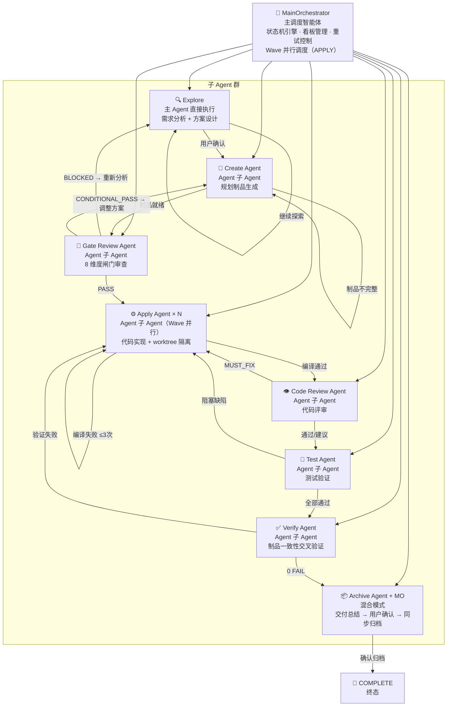
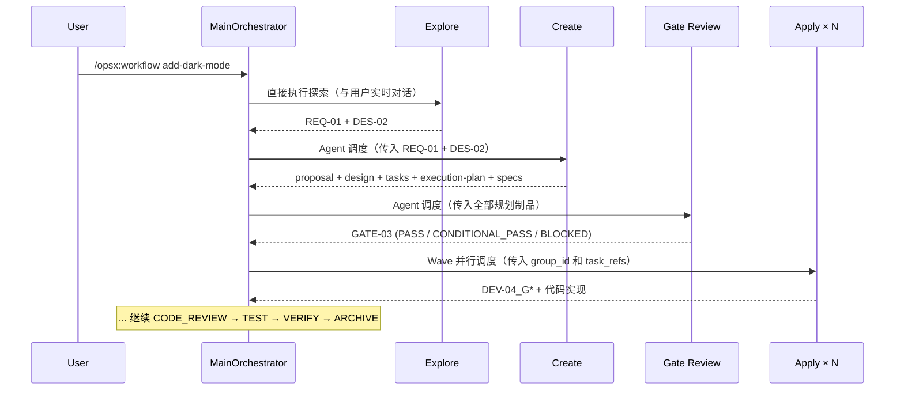

# OpenSpec Agents — 多智能体开发工作流

基于状态机的多智能体协作开发框架。由一个主调度器（MainOrchestrator）驱动 8 个专职子 Agent，通过严格的阶段跃迁规则和 OpenSpec 标准化文档协议，完成从需求分析到交付归档的完整开发生命周期。

## 目录

- [核心理念](#核心理念)
- [架构总览](#架构总览)
- [智能体设计](#智能体设计)
- [工作流状态机](#工作流状态机)
- [8 维度闸门审查](#8-维度闸门审查)
- [APPLY 阶段：Wave 并行调度](#apply-阶段wave-并行调度)
- [错误恢复与回退策略](#错误恢复与回退策略)
- [目录结构](#目录结构)
- [快速开始](#快速开始)
- [命令参考](#命令参考)
- [示例：create-todos-app](#示例create-todos-app)

---

## 核心理念

```
Humans steer. Agents execute.
人掌舵，Agent 干活。
```

- **职责分离**：需求分析不碰代码生成，代码实现不碰需求分析——每个 Agent 只做一件事
- **闸门强制**：代码变更前必须通过 8 维度闸门审查，用系统约束代替个人判断
- **文档即协议**：OpenSpec 文档格式是 Agent 间的统一通信协议，仓库里的知识是唯一真相源
- **自动化验证闭环**：Rules（规则）→ Skills（技能）→ Scripts（脚本）三层架构，能用机器检查的绝不依赖记忆
- **回退有上限**：同一阶段连续失败 3 次 → 自动暂停，等待人类决策

## 架构总览



**跨平台三层架构**：

| 层级                 | 目录       | 作用                                                 |
| -------------------- | ---------- | ---------------------------------------------------- |
| **共享核心**         | `.agents/` | Agent 指令体、状态机定义、脚本、Skills——所有平台通用 |
| **Claude Code 适配** | `.claude/` | YAML 注册、Rules（alwaysApply）、Skills 入口         |
| **Cursor 适配**      | `.cursor/` | YAML 注册、Rules、Skills 入口、用户命令              |

| 层级              | 载体                                  | 作用                      | 示例                                             |
| ----------------- | ------------------------------------- | ------------------------- | ------------------------------------------------ |
| **Rules**         | `.claude/rules/` / `.cursor/rules/`   | 保证不遗漏关键流程        | `multi-agent-workflow.md`（`alwaysApply: true`） |
| **Skills**        | `.claude/skills/` / `.cursor/skills/` | 封装每个 Agent 的执行步骤 | `agent-apply/SKILL.md`                           |
| **Scripts**       | `.agents/scripts/`                    | 自动化检查脚本            | `compile_check.ps1`, `gate_review.ps1`           |
| **State Machine** | `.agents/workflow/`                   | 形式化状态定义和跃迁规则  | `state-machine.yaml`                             |

## 智能体设计

### MainOrchestrator（主调度器）

> 唯一调度者，永不执行者（EXPLORE 和 ARCHIVE 用户确认步骤除外）

| 属性         | 说明                                                                       |
| ------------ | -------------------------------------------------------------------------- |
| **角色**     | 流程总控，协调阶段推进与决策                                               |
| **执行方式** | 主 Agent 直接执行（EXPLORE 阶段直接交互 + ARCHIVE 用户确认后执行同步归档） |
| **Skill**    | `orchestrator-main`                                                        |
| **模型策略** | 轻量模型处理调度逻辑                                                       |

**核心职责**：

- 管理状态机，判断阶段推进/回退
- EXPLORE 阶段亲自执行（需要与用户实时交互）
- 通过 Agent 工具调度子 Agent（CREATE 起）
- APPLY 阶段管理 Wave 并行调度和 worktree 合并
- ARCHIVE 阶段用户确认后执行 specs 同步和变更归档
- 维护项目看板，提供跨会话"记忆"
- 回退超过 3 次时汇报用户，请求人工介入

**约束边界**：MainOrchestrator **严禁**编写代码、修改规划制品、执行编译测试、或"代劳"子 Agent 的工作。

### 子 Agent 一览

| Agent                 | 阶段        | 调度方式                     | Skill               | 核心产出                                                                |
| --------------------- | ----------- | ---------------------------- | ------------------- | ----------------------------------------------------------------------- |
| **Explore Agent**     | EXPLORE     | 主 Agent 直接执行            | `agent-explore`     | `REQ-01` 需求分析 + `DES-02` 方案设计                                   |
| **Create Agent**      | CREATE      | Agent 子 Agent               | `agent-create`      | `proposal.md`, `design.md`, `tasks.md`, `execution-plan.yaml`, `specs/` |
| **Gate Review Agent** | GATE_REVIEW | Agent 子 Agent               | `agent-gate-review` | `GATE-03` 8 维度闸门审查报告                                            |
| **Apply Agent** × N   | APPLY       | Agent 子 Agent（Wave 并行）  | `agent-apply`       | `DEV-04` 开发记录 + 代码实现                                            |
| **Code Review Agent** | CODE_REVIEW | Agent 子 Agent               | `agent-code-review` | `CR-05` 代码评审报告                                                    |
| **Test Agent**        | TEST        | Agent 子 Agent               | `agent-test`        | `TEST-06` 测试报告                                                      |
| **Verify Agent**      | VERIFY      | Agent 子 Agent               | `agent-verify`      | `VERIFY-07` 验证报告                                                    |
| **Archive Agent**     | ARCHIVE     | Agent 子 Agent + MO 亲自执行 | `agent-archive`     | 交付总结 + 归档变更                                                     |

**注**：SYNC 阶段已合并到 ARCHIVE 阶段，由 MainOrchestrator 在用户确认后统一执行 specs 同步和变更归档，不再有独立的 Sync Agent。

### 智能体通信协议

所有 Agent 之间通过 **OpenSpec 标准化文档**通信，每个阶段的产出文档是下一阶段的输入。关键原则：

- **文档即协议**：没有隐式的"Agent A 告诉 Agent B 了什么"——一切都在仓库文件中
- **单一真相源**：OpenSpec 文档是唯一可信的状态记录
- **可审计**：完整的文档链形成不可篡改的开发审计轨迹



## 工作流状态机

```
[EXPLORE] → [CREATE] → [GATE_REVIEW] → [APPLY] → [CODE_REVIEW] → [TEST] → [VERIFY] → [ARCHIVE] → COMPLETE
     ↑           ↑                         ↑           ↑               ↑         ↑         ↑
  回退需求    回退方案                  回退开发     回退开发        回退开发   回退开发   回退开发
```

### 状态跃迁规则

| 当前状态    | 下一状态    | 跃迁条件                                                    |
| ----------- | ----------- | ----------------------------------------------------------- |
| EXPLORE     | CREATE      | 需求分析和方案设计完成，用户确认                            |
| EXPLORE     | EXPLORE     | 方案不完善，继续探索                                        |
| CREATE      | GATE_REVIEW | proposal / design / tasks / execution-plan / specs 全部就绪 |
| CREATE      | CREATE      | 制品不完整，重新生成                                        |
| GATE_REVIEW | APPLY       | 闸门通过 (PASS)                                             |
| GATE_REVIEW | EXPLORE     | 闸门阻塞 (BLOCKED)，需重新分析需求                          |
| GATE_REVIEW | CREATE      | 有条件通过 (CONDITIONAL_PASS)，需调整方案                   |
| APPLY       | CODE_REVIEW | 所有 Wave 合并完成且编译通过                                |
| APPLY       | APPLY       | 编译失败或合并冲突，自动修复重试（最多 3 次）               |
| CODE_REVIEW | TEST        | 评审通过或仅有建议项                                        |
| CODE_REVIEW | APPLY       | 有必改项 (MUST_FIX)，回退修复                               |
| TEST        | VERIFY      | 所有测试通过                                                |
| TEST        | APPLY       | 有阻塞缺陷，回退修复                                        |
| VERIFY      | ARCHIVE     | 验证通过 (0 FAIL)                                           |
| VERIFY      | APPLY       | 验证失败，回退修复                                          |
| ARCHIVE     | COMPLETE    | 用户确认归档完成（含 specs 同步）                           |

## 8 维度闸门审查

Gate Review Agent 在任何代码变更前执行 8 维度审查，是"Gate before code"原则的体现：

| #   | 维度                                    | 检查内容                                         |
| --- | --------------------------------------- | ------------------------------------------------ |
| 1   | **Scope Clarity**（范围清晰度）         | In Scope / Out of Scope 是否明确定义？是否越界？ |
| 2   | **Requirement Integrity**（需求完整性） | P0 需求是否全覆盖？非功能需求是否涉及？          |
| 3   | **Design Feasibility**（设计可行性）    | 技术方案是否可行？依赖项是否可用？               |
| 4   | **Architecture Alignment**（架构对齐）  | 新模块是否与现有架构风格一致？                   |
| 5   | **Risk Assessment**（风险评估）         | 风险是否充分识别？是否有缓解措施？               |
| 6   | **Task Completeness**（任务完整性）     | 是否覆盖所有模块？任务是否原子化？               |
| 7   | **Spec Compliance**（规格合规性）       | 每个 requirement 是否有 Given-When-Then 场景？   |
| 8   | **Rollback Plan**（回滚方案）           | 是否有明确的回滚方案？                           |

**审查结论**：

- **PASS**：全部 8 维度通过 → 推进至 APPLY
- **CONDITIONAL_PASS**：有改进建议但无硬伤 → 列出条件项，由 Create Agent 修复后重新审查
- **BLOCKED**：存在结构性缺陷 → 根据问题回退至 EXPLORE 或 CREATE

## APPLY 阶段：Wave 并行调度

APPLY 阶段是唯一支持并行执行的阶段。MainOrchestrator 读取 `execution-plan.yaml` 中定义的任务分组和依赖关系，构建 DAG 并按 Wave 拓扑排序并行派发 Apply Agent。

### 调度流程

```
1. 读取 execution-plan.yaml → 构建 DAG
2. 拓扑排序 → 划分 Waves
3. 创建 apply-base 分支
4. Wave N = {所有 depends_on 已满足的 groups}
   ┌─ 并行派发 Apply Agent × len(Wave N) ──────────┐
   │  每个 Agent 在独立 worktree 中执行指定的 group   │
   │  只执行 task_refs 中的任务（非全部 tasks.md）     │
   └─────────────────────────────────────────────────┘
   → 等待全部完成 → git merge 到 apply-base
       → 冲突？→ 暂停，报告用户
       → 无冲突？→ 推进 Wave N+1
5. 全部 Waves 完成后 → 派发 FINAL Apply Agent 汇总
6. 合并到主分支，清理 worktrees，推进至 CODE_REVIEW
```

### 核心产物

- `execution-plan.yaml`：定义 groups、task_refs、depends_on、touched_files，由 Create Agent 生成
- `DEV-04_G*_development.md`：每个 group 的独立开发记录
- `DEV-04_development.md`：FINAL Agent 汇总的全部开发记录

若 `execution-plan.yaml` 不存在或 groups 为空 → 回退到单 Agent 串行模式（旧行为兼容）。

## 错误恢复与回退策略

| 失败类型              | 处理方式                              | 回退目标          |
| --------------------- | ------------------------------------- | ----------------- |
| 编译失败              | Apply Agent 内部自动重试（最多 3 次） | APPLY             |
| 编译失败 > 3 次       | 向用户汇报，请求人工介入              | —                 |
| Wave 合并冲突         | 暂停，向用户汇报冲突文件和 groups     | —                 |
| 闸门阻塞 (BLOCKED)    | 回退重新分析                          | EXPLORE 或 CREATE |
| 评审必改项 (MUST_FIX) | 必改项转为修复 tasks                  | APPLY             |
| 测试阻塞缺陷          | 缺陷转为修复 tasks                    | APPLY             |
| 验证失败              | 失败项转为修复 tasks                  | APPLY             |

**重试上限**：同一阶段连续回退 3 次 → **暂停并向用户汇报**当前状态、阻塞原因和已尝试次数，请求人工决策。

## 目录结构

```
openspec-agents/
├── .agents/                                  # 共享核心（跨平台通用）
│   ├── agents/                               # Agent 指令体（body）
│   │   ├── apply-agent.body.md               # 代码实现指令
│   │   ├── archive-agent.body.md             # 归档检查指令
│   │   ├── code-review-agent.body.md         # 代码评审指令
│   │   ├── create-agent.body.md              # 规划生成指令
│   │   ├── gate-review-agent.body.md         # 闸门审查指令
│   │   ├── sync-agent.body.md                # 规格同步指令（ARCHIVE 阶段调用）
│   │   ├── test-agent.body.md                # 测试验证指令
│   │   └── verify-agent.body.md              # 完整验证指令
│   ├── skills/                               # 共享 Skill 定义
│   │   ├── agent-explore/SKILL.md            # 探索模式
│   │   └── orchestrator-main/SKILL.md        # 主调度器
│   ├── workflow/                             # 状态机与工作流定义
│   │   ├── state-machine.yaml                # 状态机形式化定义
│   │   ├── project-board-template.yaml       # 项目看板模板
│   │   └── execution-plan-schema.yaml        # 并行执行计划格式规范
│   └── scripts/                              # 自动化脚本
│       ├── compile_check.ps1                  # 编译检查
│       ├── gate_review.ps1                    # 闸门审查
│       ├── test_runner.ps1                    # 测试运行
│       └── verify_all.ps1                     # 全量验证
├── .claude/                                  # Claude Code 平台适配
│   ├── agents/                               # Agent YAML 注册（frontmatter: tools, model）
│   │   ├── apply-agent.md
│   │   ├── archive-agent.md
│   │   ├── code-review-agent.md
│   │   ├── create-agent.md
│   │   ├── gate-review-agent.md
│   │   ├── sync-agent.md
│   │   ├── test-agent.md
│   │   └── verify-agent.md
│   ├── rules/
│   │   └── multi-agent-workflow.md           # 主调度规则（alwaysApply）
│   └── skills/                               # Claude Code 特化 Skill 入口
│       ├── agent-explore/SKILL.md
│       ├── orchestrator-main/SKILL.md
│       ├── openspec-new-change/SKILL.md
│       ├── openspec-ff-change/SKILL.md
│       ├── openspec-apply-change/SKILL.md
│       ├── openspec-verify-change/SKILL.md
│       ├── openspec-sync-specs/SKILL.md
│       ├── openspec-archive-change/SKILL.md
│       ├── openspec-explore/SKILL.md
│       └── openspec-continue-change/SKILL.md
├── .cursor/                                  # Cursor 平台适配
│   ├── agents/                               # Agent YAML 注册（frontmatter: readonly, model）
│   ├── rules/
│   │   └── multi-agent-workflow.md           # 主调度规则
│   ├── skills/                               # Cursor 特化 Skill 入口
│   └── commands/                             # 用户命令（/opsx:*）
│       ├── opsx-workflow.md
│       ├── opsx-workflow-status.md
│       ├── opsx-workflow-resume.md
│       ├── opsx-explore.md
│       ├── opsx-new.md
│       ├── opsx-ff.md
│       ├── opsx-apply.md
│       ├── opsx-verify.md
│       ├── opsx-sync.md
│       ├── opsx-archive.md
│       └── opsx-continue.md
├── openspec/
│   ├── config.yaml                           # OpenSpec 项目配置
│   ├── specs/                                # 主规格库
│   │   └── <capability>/
│   └── changes/
│       └── archive/
│           └── <date>-<change-name>/          # 已归档的变更
│               ├── .openspec.yaml
│               ├── proposal.md
│               ├── design.md
│               ├── tasks.md
│               ├── execution-plan.yaml        # 并行执行计划
│               ├── specs/                     # 增量规格
│               └── session/                   # 会话制品
│                   ├── project-board.yaml      # 变更看板
│                   ├── REQ-01_requirement_analysis.md
│                   ├── DES-02_solution_design.md
│                   ├── GATE-03_gate_review.md
│                   ├── DEV-04_development.md   # 汇总开发记录
│                   ├── DEV-04_G*_development.md # 各 group 开发记录
│                   ├── CR-05_code_review.md
│                   ├── TEST-06_test_report.md
│                   ├── VERIFY-07_verification_report.md
│                   └── DELIVERY_SUMMARY.md
└── docs/
    ├── workflow-architecture-diagrams.md
    └── explore.md
```

## 快速开始

### 启动一个完整的开发工作流

在 Claude Code（或 Cursor）中输入：

```
/opsx:workflow [变更名 | 需求描述 | 变更名 + 需求描述]
```

系统会自动识别输入类型，无需手动区分。例如：

```
/opsx:workflow add-dark-mode                       # 仅变更名
/opsx:workflow 添加暗色模式                          # 仅需求描述，自动推导变更名
/opsx:workflow add-dark-mode 支持自动切换深色主题     # 变更名 + 需求描述
```

MainOrchestrator 将自动接管，依次执行：

1. **EXPLORE**：与你实时对话，澄清需求、分析代码库现状、设计技术方案
2. **CREATE**：自动生成 proposal.md、design.md、tasks.md、execution-plan.yaml 和增量 specs
3. **GATE_REVIEW**：8 维度闸门审查，拦截设计缺陷
4. **APPLY**：按 execution-plan.yaml 的 Wave 分组并行实现代码（支持 worktree 隔离），编译检查
5. **CODE_REVIEW**：代码评审，发现自审盲区
6. **TEST**：运行测试套件
7. **VERIFY**：制品一致性全量交叉验证
8. **ARCHIVE**：生成交付总结，用户确认后执行 specs 同步和变更归档

### 查看工作流状态

```
/opsx:workflow-status
```

### 恢复中断的工作流

```
/opsx:workflow-resume
```

MainOrchestrator 会从项目看板（`project-board.yaml`）中恢复上次的上下文并继续。

### 单独使用各阶段

你也可以跳过完整工作流，单独使用各阶段命令：

| 命令                      | 作用                 |
| ------------------------- | -------------------- |
| `/opsx:explore <topic>`   | 探索式对话，调研方案 |
| `/opsx:new <change-name>` | 创建新变更骨架       |
| `/opsx:ff <change-name>`  | 快速生成全部规划制品 |
| `/opsx:apply`             | 执行变更任务         |
| `/opsx:verify`            | 验证代码与制品一致性 |
| `/opsx:sync`              | 同步增量规格         |
| `/opsx:archive`           | 归档已完成变更       |
| `/opsx:continue`          | 继续未完成的变更     |

## 模型映射策略

| Agent             | 模型   | 理由                     |
| ----------------- | ------ | ------------------------ |
| Apply Agent       | opus   | 代码生成需要最强模型     |
| Code Review Agent | opus   | 代码审查需要深度分析能力 |
| Verify Agent      | opus   | 最终验证需要高准确性     |
| Create Agent      | sonnet | 文档生成，平衡性能与成本 |
| Gate Review Agent | sonnet | 审查分析，平衡性能与成本 |
| Archive Agent     | sonnet | 归档检查无需最强模型     |
| Test Agent        | haiku  | 测试运行可用轻量模型     |

## 跨平台设计

本项目支持 Claude Code 和 Cursor 两个平台，通过分层设计实现共享核心 + 平台适配：

| 差异点     | Claude Code                                  | Cursor                                    |
| ---------- | -------------------------------------------- | ----------------------------------------- |
| 调度工具   | `Agent`                                      | `Task`                                    |
| Agent 定义 | `.claude/agents/<agent>.md`                  | `.cursor/agents/<agent>.md`               |
| 指令体     | 从 `.agents/agents/*.body.md` 注入 prompt    | 从 `.agents/agents/*.body.md` 注入 prompt |
| 模型选择   | YAML frontmatter `model` + Agent 参数        | YAML frontmatter `model`                  |
| 权限控制   | YAML frontmatter `tools`                     | YAML frontmatter `readonly`               |
| 隔离执行   | `isolation: "worktree"`（独立 git worktree） | 无                                        |
| 异步执行   | `run_in_background: true`（独立 CLI 子进程） | 无                                        |

## 示例：create-todos-app

作为本工作流的实战验证，项目通过完整的 8 阶段流程交付了一个基于 Vue 3 + TypeScript 的看板式 Todo 管理应用：

| 阶段        | 结果                | 说明                                                                              |
| ----------- | ------------------- | --------------------------------------------------------------------------------- |
| EXPLORE     | ✅ 完成             | 需求分析 + 方案设计（三层架构：Presentation → State → Persistence）               |
| CREATE      | ✅ 完成             | 生成 4 个能力域 specs（todo-crud, kanban-board, search-filter, data-persistence） |
| GATE_REVIEW | ✅ CONDITIONAL_PASS | 1 次回退：发现设计缺陷，修复后通过                                                |
| APPLY       | ✅ 完成             | 13 个新文件，~2000+ 行代码，编译通过                                              |
| CODE_REVIEW | ✅ 通过             | 1 次回退：初审 3 MUST_FIX → 修复后重审通过                                        |
| TEST        | ✅ 完成             | 编译 + 手动验证清单全部通过                                                       |
| VERIFY      | ✅ 完成             | 代码-文档-规格-任务全量交叉验证通过                                               |
| ARCHIVE     | ✅ 完成             | specs 同步 + 归档至 `openspec/changes/archive/`                                   |

**总计**：2 次回退（Gate Review 1 次 + Code Review 1 次），均在重试上限内自动恢复。交付物质量经验证确认一致。

---

## 设计原则总结

> 本项目的设计受到 [Harness Engineering (https://mp.weixin.qq.com/s/NtsksL2gkMtMqkILi4xvRg)](https://mp.weixin.qq.com/s/NtsksL2gkMtMqkILi4xvRg) 理念的启发，核心对齐以下原则：

1. **协议标准化** — OpenSpec 文档作为 Agent 间的统一通信协议，消除信息散落
2. **状态机驱动** — 严格的跃迁规则从系统层面避免了"既当运动员又当裁判"
3. **职责分离** — Explore 不碰代码，Apply 不碰需求——职责分离本身就是质量保障
4. **Gate before code** — 任何代码变更前必须通过独立的闸门审查
5. **自动化验证闭环** — Rules → Skills → Scripts 三层架构，机器检查代替人工记忆
6. **错误恢复有界** — 明确的回退路径和重试上限，避免无限循环
7. **跨会话可恢复** — 项目看板提供持久化状态，新会话可从断点恢复
8. **Wave 并行加速** — APPLY 阶段基于 DAG 拓扑排序实现任务分组并行，缩短交付周期
9. **跨平台共享** — 共享 `.agents/` 核心逻辑 + 平台适配层，避免双平台指令漂移
