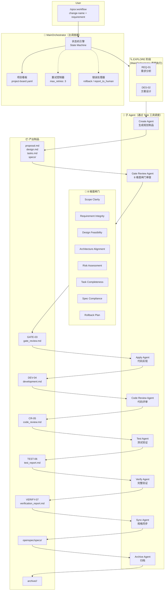
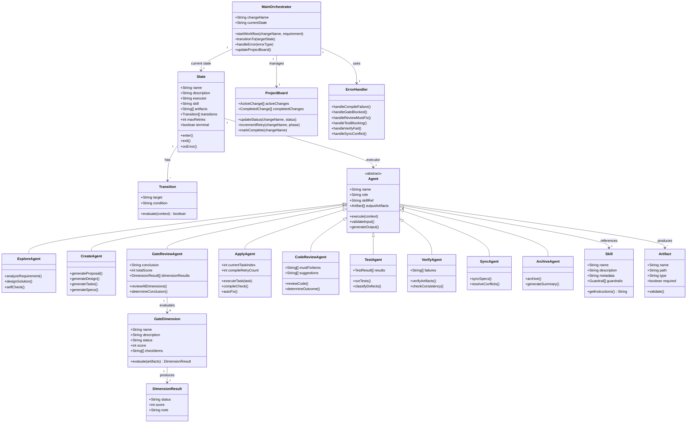
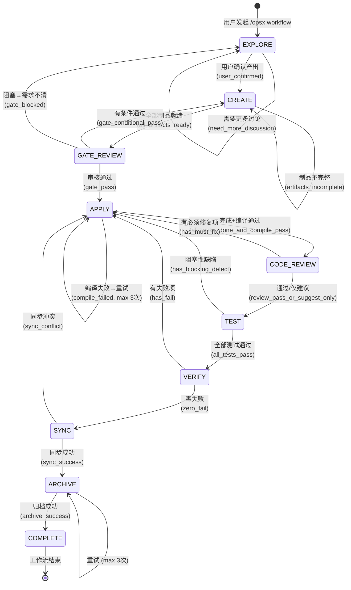
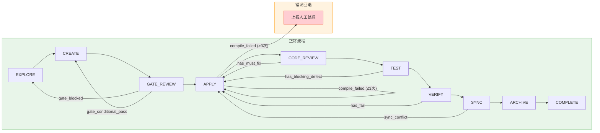

# 多智能体工作流设计 — Mermaid 图示

> 基于 `.cursor/commands/opsx-workflow.md` 与 `workflow/state-machine.yaml`

---

## 1. 架构图 — 多智能体工作流总览

---

## 2. 类图 — 核心实体与关系

---

## 3. 序列图 — 完整工作流执行时序

```mermaid
sequenceDiagram
    actor User
    participant MO as MainOrchestrator
    participant SM as StateMachine
    participant PB as ProjectBoard
    participant EA as Explore Agent<br/>(MO 直接执行)
    participant CA as Create Agent<br/>(Task)
    participant GA as Gate Review Agent<br/>(Task)
    participant AA as Apply Agent<br/>(Task)
    participant CRA as Code Review Agent<br/>(Task)
    participant TA as Test Agent<br/>(Task)
    participant VA as Verify Agent<br/>(Task)
    participant SA as Sync Agent<br/>(Task)
    participant ARA as Archive Agent<br/>(Task)

    User->>MO: /opsx:workflow add-dark-mode "需求描述"
    MO->>MO: 解析参数
    MO->>PB: openspec list --json（检查重复）
    PB-->>MO: 无同名变更
    MO->>PB: 初始化 project-board.yaml
    MO->>SM: 进入 EXPLORE

    rect rgb(230, 245, 255)
        Note over MO,EA: EXPLORE 阶段（主 Agent 直接交互）
        MO->>EA: 读取需求 + 调研代码库
        EA->>EA: 逐条拆解，标注模糊点
        EA-->>User: 展示多义性，请求澄清
        User-->>EA: 确认/补充
        EA->>EA: 生成 REQ-01_requirement_analysis.md
        EA->>EA: 对比方案 → 生成 DES-02_solution_design.md
        EA->>EA: 自查产出完整性
        EA-->>User: 展示方案，请求确认
        User-->>MO: ✅ 确认通过
    end

    MO->>SM: 转换 → CREATE
    MO->>PB: 更新状态

    rect rgb(255, 245, 230)
        Note over CA: CREATE 阶段
        MO->>CA: Task 工具调度（run_in_background）
        CA->>CA: 读取 REQ-01 + DES-02
        CA->>CA: 生成 proposal.md
        CA->>CA: 生成 design.md
        CA->>CA: 生成 tasks.md
        CA->>CA: 生成 specs/
        CA-->>MO: ✅ 全部制品就绪
    end

    MO->>SM: 转换 → GATE_REVIEW
    MO->>PB: 更新状态 + incrementRetry

    rect rgb(255, 230, 230)
        Note over GA: GATE_REVIEW 阶段
        MO->>GA: Task 工具调度（run_in_background）
        GA->>GA: 读取全部规划制品
        GA->>GA: 8 维度逐项审查
        alt 审查通过 (PASS)
            GA-->>MO: ✅ 结论 PASS
        else 条件通过 (CONDITIONAL_PASS)
            GA-->>MO: ⚠️ 结论 CONDITIONAL_PASS（附条件项）
            MO->>MO: 评估是否可以进入 APPLY
        else 阻塞 (BLOCKED)
            GA-->>MO: ❌ 结论 BLOCKED（附阻塞原因）
            MO->>SM: 回退 EXPLORE / CREATE
        end
    end

    MO->>SM: 转换 → APPLY
    MO->>PB: 更新状态

    rect rgb(230, 255, 230)
        Note over AA: APPLY 阶段
        MO->>AA: Task 工具调度（run_in_background）
        loop 每个任务
            AA->>AA: 执行 Task X.Y
            AA->>AA: 编译检查
            alt 编译通过
                AA->>AA: ✅ 标记任务完成
            else 编译失败
                AA->>AA: 自动修复（最多 3 次）
                alt 修复成功
                    AA->>AA: ✅ 标记任务完成
                else 3 次失败
                    AA->>AA: ❌ 记录 Issue，上报
                end
            end
        end
        AA->>AA: 生成 DEV-04_development.md
        AA-->>MO: ✅ 全部任务完成 + 编译通过
    end

    MO->>SM: 转换 → CODE_REVIEW
    MO->>PB: 更新状态

    rect rgb(240, 230, 255)
        Note over CRA: CODE_REVIEW 阶段
        MO->>CRA: Task 工具调度（run_in_background）
        CRA->>CRA: 审查全部代码变更
        CRA->>CRA: 生成 CR-05_code_review.md
        alt 通过 / 仅建议
            CRA-->>MO: ✅ 通过
        else 有 must_fix
            CRA-->>MO: ❌ must_fix 项 → 回退 APPLY
            MO->>SM: 回退 APPLY
        end
    end

    MO->>SM: 转换 → TEST
    MO->>PB: 更新状态

    rect rgb(255, 255, 230)
        Note over TA: TEST 阶段
        MO->>TA: Task 工具调度（run_in_background）
        TA->>TA: 运行测试
        TA->>TA: 生成 TEST-06_test_report.md
        alt 全部通过
            TA-->>MO: ✅ 所有测试通过
        else 有阻塞性缺陷
            TA-->>MO: ❌ blocking defect → 回退 APPLY
            MO->>SM: 回退 APPLY
        end
    end

    MO->>SM: 转换 → VERIFY
    MO->>PB: 更新状态

    rect rgb(255, 235, 220)
        Note over VA: VERIFY 阶段
        MO->>VA: Task 工具调度（run_in_background）
        VA->>VA: 完整验证（制品一致性）
        VA->>VA: 生成 VERIFY-07_verification_report.md
        alt 零失败
            VA-->>MO: ✅ 验证通过
        else 有失败项
            VA-->>MO: ❌ has_fail → 回退 APPLY
            MO->>SM: 回退 APPLY
        end
    end

    MO->>SM: 转换 → SYNC
    MO->>PB: 更新状态

    rect rgb(220, 240, 240)
        Note over SA: SYNC 阶段
        MO->>SA: Task 工具调度（run_in_background）
        SA->>SA: 增量规格 → 主规格同步
        alt 同步成功
            SA-->>MO: ✅ 同步完成
        else 冲突
            SA-->>MO: ❌ sync_conflict → 回退 APPLY
            MO->>SM: 回退 APPLY
        end
    end

    MO->>SM: 转换 → ARCHIVE
    MO->>PB: 更新状态

    rect rgb(240, 240, 250)
        Note over ARA: ARCHIVE 阶段
        MO->>ARA: Task 工具调度（run_in_background）
        ARA->>ARA: 归档到 archive/<change-name>/
        ARA->>ARA: 生成交付总结 + 更新看板
        ARA-->>MO: ✅ 归档完成
    end

    MO->>SM: 转换 → COMPLETE
    MO->>PB: markComplete
    MO-->>User: 🎉 工作流完成: <change-name>
```

---

## 4. 甘特图 — 阶段时间线与依赖

```mermaid
gantt
    title 多智能体工作流 — 阶段执行甘特图
    dateFormat  HH:mm
    axisFormat  %H:%M

    section EXPLORE（主Agent）
    读取需求 + 调研代码库           :e1, 00:00, 10m
    需求分析 → REQ-01               :e2, after e1, 15m
    方案设计 → DES-02               :e3, after e2, 20m
    用户确认                         :milestone, after e3, 0m

    section CREATE（Create Agent）
    生成 proposal.md + design.md    :c1, after e3, 15m
    生成 tasks.md + specs/          :c2, after c1, 15m
    制品就绪检查                     :milestone, after c2, 0m

    section GATE_REVIEW（Gate Review Agent）
    维度 1-2: Scope + Requirement   :g1, after c2, 5m
    维度 3-4: Design + Architecture :g2, after g1, 5m
    维度 5-6: Risk + Task           :g3, after g2, 5m
    维度 7-8: Spec + Rollback       :g4, after g3, 5m
    审查结论                         :milestone, after g4, 0m

    section APPLY（Apply Agent）
    Task 1.1 实现                    :a1, after g4, 10m
    Task 1.2 实现                    :a2, after a1, 10m
    Task 2.1 实现                    :a3, after a2, 15m
    Task 2.2 实现                    :a4, after a3, 10m
    编译检查 + 开发记录              :a5, after a4, 5m

    section CODE_REVIEW（Code Review Agent）
    代码审查                         :cr1, after a5, 15m
    审查结论                         :milestone, after cr1, 0m

    section TEST（Test Agent）
    运行测试套件                     :t1, after cr1, 20m
    测试报告                         :milestone, after t1, 0m

    section VERIFY（Verify Agent）
    制品一致性验证                   :v1, after t1, 15m
    验证报告                         :milestone, after v1, 0m

    section SYNC（Sync Agent）
    规格同步                         :s1, after v1, 5m

    section ARCHIVE（Archive Agent）
    归档 + 交付总结                  :ar1, after s1, 5m
    完成                             :milestone, after ar1, 0m
```

> **说明**: 以上时长仅为示意，实际耗时取决于变更规模和复杂度。状态机支持各阶段回退（如 Apply → Code Review → Apply），回退时对应阶段会重新执行，最多重试 3 次。

---

## 附：状态转换图

---

## 附：错误处理回退路径

