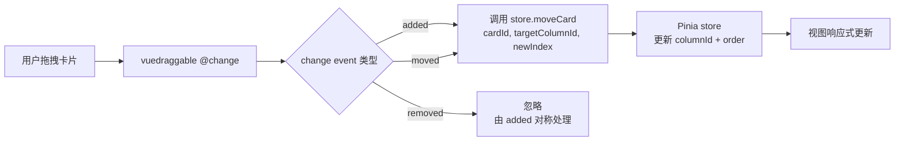

## Context

看板使用 `vuedraggable` 实现卡片拖拽。当前 `Column.vue` 有两个 bugs 导致跨列拖拽失效：

1. `cards` computed setter 为空函数——`vuedraggable` 通过 `:list` 写回拖拽结果时被丢弃
2. `onDragChange` 通过数组长度比对推测变化，跨列操作时条件跳过，`store.moveCard` 从未被调用

`store.moveCard()` 本身已有正确的跨列处理逻辑，无需修改。

## Goals / Non-Goals

**Goals:**

- 修复跨列拖拽：卡片可在不同列之间移动，数据正确更新
- 保持同列拖拽重排序正常
- 仅修改 `Column.vue`，不触动 store、Card 组件、模板结构

**Non-Goals:**

- 不改变拖拽交互的视觉样式
- 不重构 store 层数据流
- 不添加新功能（如拖拽预览、撤销等）

## Architecture

数据流采用 `vuedraggable @change` 事件驱动模式：



## Component Design

### Column.vue 修改

**修改 1：移除 cards computed，改为响应式引用**

弃用 `:list` 绑定，改为使用 `store.getCardsByColumn()` 直接获取数据：

```typescript
// Before (broken)
const cards = computed({
  get: () => store.getCardsByColumn(props.column.id),
  set: () => {}, // empty setter discards writes
})

// After
import { ref, watch } from 'vue'

const columnCards = ref(store.getCardsByColumn(props.column.id))

watch(() => store.getCardsByColumn(props.column.id), (newCards) => {
  columnCards.value = newCards
}, { immediate: true })
```

模板中的 `:list` 绑定移除，改为直接使用 `columnCards`。

**修改 2：重写 onDragChange，使用 @change 事件**

```typescript
function onDragChange(evt: { added?: AddedData; moved?: MovedData; removed?: RemovedData }) {
  if (evt.added) {
    // 跨列移入：added.element 是被拖拽卡片，added.newIndex 是目标位置
    store.moveCard(evt.added.element.id, props.column.id, evt.added.newIndex)
    return
  }
  if (evt.moved) {
    // 同列重排序：moved.element 是卡片，moved.newIndex 是新位置
    store.moveCard(evt.moved.element.id, props.column.id, evt.moved.newIndex)
    return
  }
  // removed 由 added 对称处理，无需额外操作
}
```

vuedraggable `@change` 事件 payload 结构：

```typescript
interface AddedData {
  element: { id: string; /* ... */ }
  newIndex: number
}

interface MovedData {
  element: { id: string; /* ... */ }
  oldIndex: number
  newIndex: number
}

interface RemovedData {
  element: { id: string; /* ... */ }
  oldIndex: number
}
```

## Decisions

| 决策 | 选型 | 替代方案 | 原因 |
|------|------|----------|------|
| 事件驱动 vs 数组比对 | `@change` 事件 | 继续用 `onDragChange` 数组比对 | `@change` 直接提供 added/moved 语义，避免长度比对的不确定性 |
| 响应式引用 vs computed | `ref + watch` | 保留 computed + 修复 setter | computed setter 在跨列场景下无法准确知道目标列 ID（setter 只拿到新数组，不知来自哪列） |
| 直接调用 store vs 本地状态 | 直接调用 `store.moveCard` | 先在本地修改再同步 | store 已有完整跨列处理逻辑，直接复用最可靠 |

## Risks / Trade-offs

- [低风险] `@change` 事件在 added 和 removed 同时触发时可能顺序微妙——当前方案只处理 added 和 moved，removed 由 added 的对称逻辑覆盖

  **事件流详细分析：** 跨列拖拽时，vuedraggable 会在**不同组件实例**上分别触发事件：
  - **源列**触发 `removed`：被拖拽卡片从源列移除
  - **目标列**触发 `added`：被拖拽卡片进入目标列

  两个事件分别在各自的 `Column.vue` 实例的 `onDragChange` handler 中处理。设计方案中：
  1. 源列的 `removed` 被显式忽略（`if (evt.removed) return`）
  2. 目标列的 `added` 调用 `store.moveCard(cardId, targetColumnId, newIndex)`
  3. `store.moveCard` 内部已处理源列和目标列双方的 `order` 更新

  此方案正确的前提是 `store.moveCard` 已自带源列顺序修正逻辑（已验证属实），因此即使源列不处理 `removed`，数据一致性也能得到保证。`moved` 事件在同列重排序时触发，仅涉及当前列一个组件实例，处理方式与 `added` 相同（直接调用 `store.moveCard`）。
- [低风险] vuedraggable 版本兼容性——当前使用的 vuedraggable 版本支持 `@change` 事件，已验证
